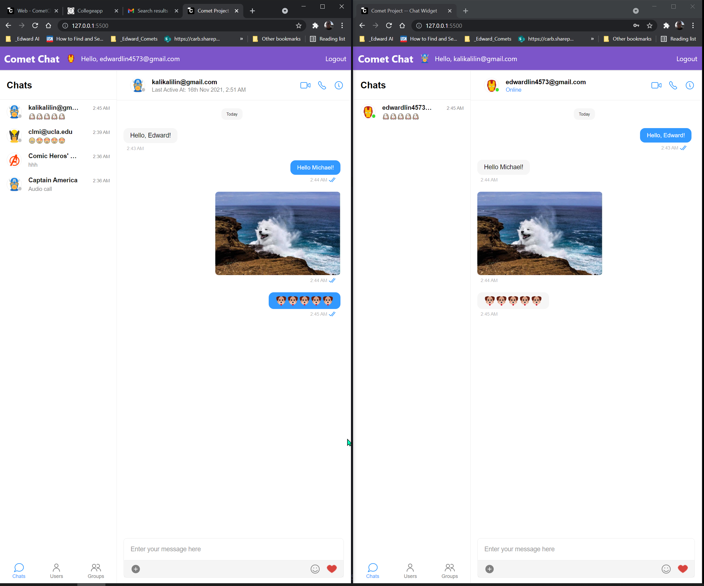

# PROJECT LEVEL 2 (SOME CODING REQUIRED)

## Chat App

One missing feature in our application is a Chat feature. People have been requesting this feature as an opportunity to chat with counselors, experts, students in a particular college, etc.

**DELIVERABLE**:

The Chat feature/app will be a simple text only chat, one to one application.
Need to differentiate between sent messages and received messages. Think WhatsApp, Messenger, Discord, etc.
Do not need to go deep in UI presentation
Normally on a chat application, we have the text we send on the right side and the text we receive on the left side, with the name/alias of the sender. Both sides should have a timestamp of when the message was sent.

**SUBMISSION** Please submit your github (or any other repository) link = [HERE](https://forms.gle/BGMextE17ZPzc3gQA) + screenshots of the application running.

Go to the Discord channel (#programmer-crew) to ask questions, get feedback from peers.
Programming Projects (either Level 1 and/or 2) are all due Nov 18th at 9pm your local time.

Please Email eng@applywithcomet.com with questions.

-------------------
Name: Edward Lin

Technologies used:

1. [CometChat Widget](https://www.cometchat.com/docs/chat-widgets/web)
2. [Firebase](https://console.firebase.google.com/)
 

**Screen Shot for Chat Widget (Docked Layout)**

**Screen Shot for Chat Widget (Embedded Layout)**

 

**Screen Shot for Users' Chats  in Chat Widget**

-------------------------------------------
References:

<https://www.cometchat.com/tutorials/how-to-build-a-javascript-chat-app>

## Useful links

- 🏠 [CometChat Homepage](https://app.cometchat.com/signup)
- 🏠 [CometChat Widget](https://prodocs.cometchat.com/v2.1/docs/web-chat-widget)
- 🚀 [Create your free account](https://app.cometchat.com/apps)
- 📚 [Documentation](https://prodocs.cometchat.com)
- 👾 [GitHub](https://www.github.com/cometchat-pro)
- 🔥 [Firebase](https://console.firebase.google.com)
- ✨ [Live Demo](https://javascript-chat-app.glitch.me)
